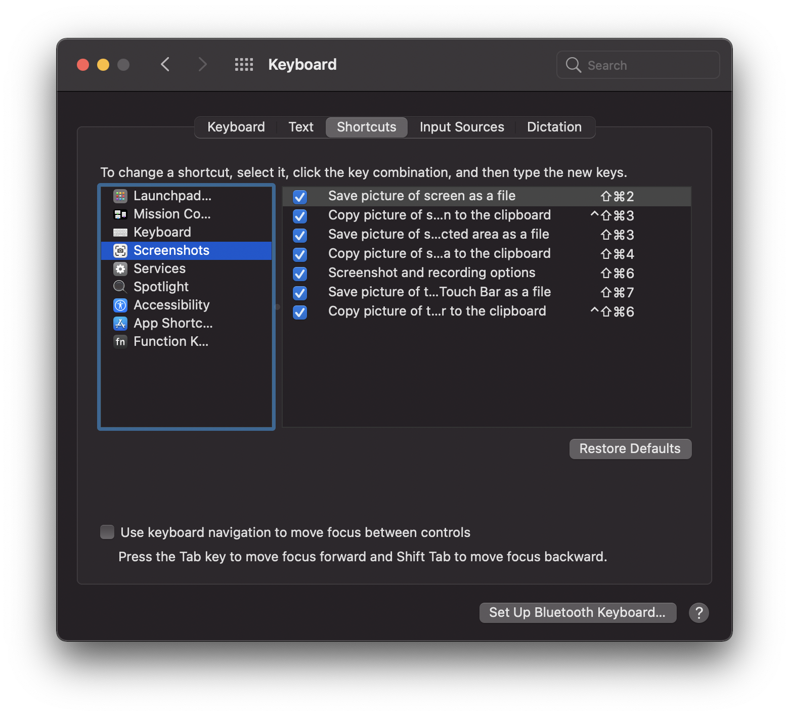
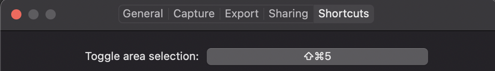

# dotfiles

## Setting up a new Mac

1. Clone this repo to `~/dev/dotfiles` (the iTerm settings below expect that path):
   `git clone https://github.com/steve-jones/dotfiles ~/dev/dotfiles && cd ~/dev/dotfiles`
2. Run `./bootstrap.exclude.sh`. It symlinks the dotfiles into your home folder, links
   `starship.toml` to `~/.config/starship.toml`, then offers to run `brew.exclude.sh`,
   which installs Homebrew, iTerm2, oh-my-zsh, Starship, the JetBrains Mono Nerd Font,
   Claude Code and the other tools.
3. Quit and reopen iTerm2. It loads its settings from `iterm2_preferences/`.

## Terminal look (updated 09/2026)

- **iTerm2:** Compact window theme, Solarized Dark colors, JetBrainsMono Nerd Font at 14 pt.
  All three are saved in `iterm2_preferences/com.googlecode.iterm2.plist`.
- **Prompt:** [Starship](https://starship.rs), configured in `starship.toml` to look like the old
  agnoster theme: colored blocks with arrow edges for the folder, git branch and status,
  Python or Node version, and how long the last command took, with the cursor on its own line.
  It replaced oh-my-zsh's agnoster theme and the Powerline fonts. oh-my-zsh still loads for
  plugins and completions, with `ZSH_THEME=""`.
- To change the prompt, edit `starship.toml`. Changes show up in the next prompt, no restart needed.

Used some stuff from this [blog post](https://www.freecodecamp.org/news/dive-into-dotfiles-part-2-6321b4a73608/)

### Screenshot keyboard shortcuts

Gifox

